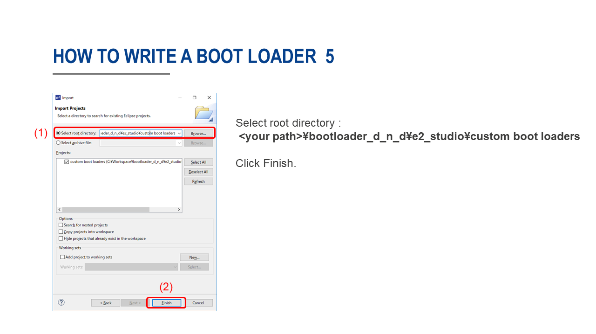

# Custom bootloader
This is a custom bootloader for RZ/A2M. By using the custom bootloader, you can drag & drop the ".bin" file to write the program. Click [here](https://github.com/d-kato/RZ_A2M_Mbed_d_n_d_src) for the source code.  

## Latest revision
revision 5

## How to use a custom bootloader
Add ``target.bootloader_img`` and ``target.app_offset`` to your project's ``mbed_app.json`` file as below.    
```
{
  ==== omit ====
    "target_overrides": {
      ==== omit ====
        "GR_MANGO": {
            "target.bootloader_img" : "bootloader_d_n_d/GR_MANGO_boot.bin",
            "target.app_offset"     : "0x11000",
            === omit ===
        },
        "RZ_A2M_EVB": {
            "target.bootloader_img" : "bootloader_d_n_d/RZ_A2M_EVB_boot.bin",
            "target.app_offset"     : "0x40000",
            === omit ===
        },
        "RZ_A2M_EVB_HF": {
            "target.bootloader_img" : "bootloader_d_n_d/RZ_A2M_EVB_HF_boot.bin",
            "target.app_offset"     : "0x40000",
            === omit ===
        },
        "RZ_A2M_SBEV": {
            "target.bootloader_img" : "bootloader_d_n_d/RZ_A2M_SBEV_boot.bin",
            "target.app_offset"     : "0x40000",
            === omit ===
        },
        "SEMB1402": {
            "target.bootloader_img" : "bootloader_d_n_d/SEMB1402_boot.bin",
            "target.app_offset"     : "0x40000",
            === omit ===
        }
    }
}
```

**Flash Layout**
```
    +--------------------------+
    |                          |
    |                          |
    |        Application       |
    |                          |
    |                          |
    +--------------------------+ <-+ target.app_offset
    |     Custom bootloader    |
    +--------------------------+ <-+ 0
```

Build the program. Two files ``xxxx.bin`` and ``xxxx_application.bin`` are created.  
``xxxx_application.bin`` is the data of ``Application`` .  
``xxxx.bin`` contains both ``custom bootloader`` and ``application`` .  


## How to write program
### For GR-MANGO
When using ``DAPLink``, please use ``xxxx.bin`` as following.  
1. Connect the ``micro USB type B terminal`` to the PC using a USB cable.
2. You can find the ``MBED`` directory.
3. Drag & drop ``xxxx.bin`` to the ``MBED`` directory.  
4. When writing is completed, press the reset button.  

When using ``custom bootloader``, please use ``xxxx_application.bin`` as following.  
1. Connect the ``USB type C terminal`` to the PC using a USB cable.  
2. Hold down ``USB0`` and press the reset button.  
3. You can find the ``GR-MANG`` directory.  
4. Drag & drop ``xxxx_application.bin`` to the ``GR-MANGO`` directory.  
5. When writing is completed, press the reset button.  

**Attention!**  
For the first time only, you need to write a ``custom bootloader`` using ``DAPLink``.  

### For other boards
1. Connect the USB cable to the PC.  
2. Hold down ``SW3 (USB0)`` and press the reset button. (Or turn on the power.)  
3. You can find the ``MBED`` directory.  
4. Drag & drop ``xxxx_application.bin`` to the ``MBED`` directory.  
5. When writing is completed, press the reset button.  

**Attention!**  
For the first time only, you need to write a ``custom bootloader`` as following.  

Download [e2studio 7.4.0 or lator](https://www.renesas.com/eu/en/products/software-tools/tools/ide/e2studio.html), and install. (Debugger : J-Link Base)  
Connect the J-Link to your board.  

  
  
  
  
  
  
